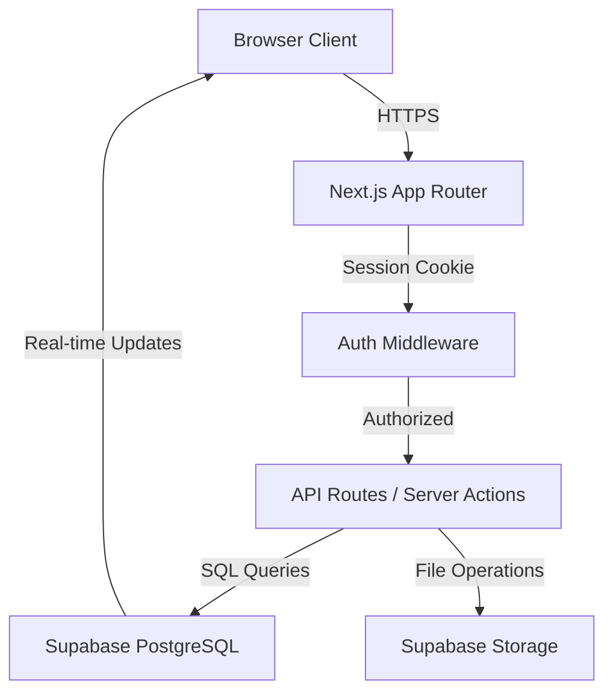
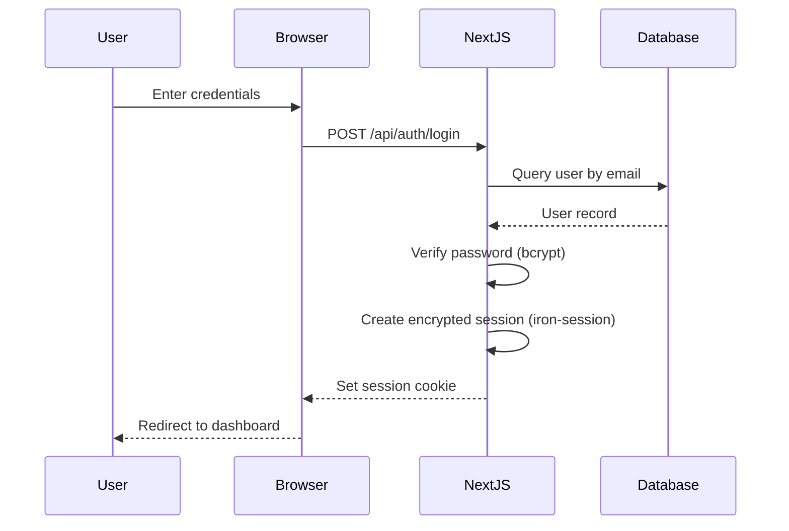
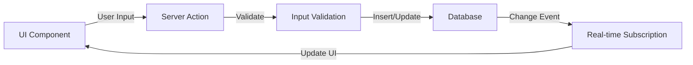

# Design Document: Structura

## Overview

Structura is a web-based event and project management platform built with Next.js 14+ (App Router), Tailwind CSS, Supabase PostgreSQL, and deployed on Vercel. The system provides secure session-based authentication, role-based access control, event management, document storage, checklist tracking, and integrated financial oversight.

The architecture follows a modern full-stack approach:
- **Frontend**: Next.js with React Server Components, Client Components, and Tailwind CSS
- **Backend**: Next.js API Routes and Server Actions
- **Database**: Supabase PostgreSQL with real-time subscriptions
  - Supabase adds real-time functionality on top of standard PostgreSQL
  - When data changes in the database, Supabase broadcasts those changes to subscribed clients
  - This enables live updates across all users without manual polling or page refreshes
  - Uses WebSocket connections to push database changes to the browser in real-time
- **Storage**: Supabase Storage for document files
- **Authentication**: Custom session-based auth using iron-session and bcrypt
  - iron-session is a stateless session library for Next.js
  - Stores encrypted session data directly in browser cookies (no server-side session storage needed)
  - Sessions are "signed and sealed" using cryptographic keys, making them tamper-proof
  - Simpler than full OAuth providers - just username/password with secure cookie-based sessions
  - bcrypt handles password hashing for secure storage
- **Styling**: Tailwind CSS with responsive design utilities
- **Deployment**: Vercel with serverless functions

Key design principles:
1. **Stateless sessions**: Encrypted cookies store session data (no server-side session storage)
2. **Role-based security**: Middleware enforces permissions at the route level
3. **Real-time updates**: Supabase subscriptions keep UI synchronized across users
4. **Incremental validation**: Client and server-side validation for data integrity
5. **Audit trail**: All critical operations logged with user and timestamp

## Architecture

### System Architecture



### Authentication Flow



### Data Flow



## Components and Interfaces

### 1. Authentication System

**Components**:
- `AuthService`: Handles user registration, login, logout, and session management
- `SessionManager`: Manages encrypted session cookies using iron-session
- `PasswordHasher`: Hashes and verifies passwords using bcrypt
- `AuthMiddleware`: Protects routes and enforces role-based access

**Key Functions**:

```typescript
// AuthService
interface AuthService {
  register(email: string, username: string, password: string, role: Role): Promise<User>
  login(email: string, password: string): Promise<SessionData>
  logout(): Promise<void>
  getCurrentUser(): Promise<User | null>
}

// SessionManager
interface SessionManager {
  createSession(userId: string, role: Role): Promise<void>
  getSession(): Promise<SessionData | null>
  destroySession(): Promise<void>
}

// PasswordHasher
interface PasswordHasher {
  hash(password: string): Promise<string>
  verify(password: string, hash: string): Promise<boolean>
}
```

**Session Structure**:
```typescript
interface SessionData {
  userId: string
  role: 'organizer' | 'officer' | 'admin'
  createdAt: number
  expiresAt: number
}
```

### 2. User Management

**Components**:
- `UserService`: CRUD operations for users
- `RoleManager`: Assigns and validates user roles

**Key Functions**:

```typescript
interface UserService {
  createUser(data: CreateUserInput): Promise<User>
  getUserById(id: string): Promise<User | null>
  getUserByEmail(email: string): Promise<User | null>
  updateUserRole(userId: string, role: Role): Promise<User>
  listUsers(): Promise<User[]>
}

interface RoleManager {
  hasPermission(role: Role, action: Action): boolean
  canAccessRoute(role: Role, path: string): boolean
}
```

### 3. Event Management

**Components**:
- `EventService`: CRUD operations for events
- `EventStatusManager`: Manages event lifecycle transitions

**Key Functions**:

```typescript
interface EventService {
  createEvent(data: CreateEventInput, userId: string): Promise<Event>
  getEventById(id: string): Promise<Event | null>
  updateEvent(id: string, data: UpdateEventInput, userId: string): Promise<Event>
  deleteEvent(id: string, userId: string): Promise<void>
  listEvents(filters?: EventFilters): Promise<Event[]>
  updateEventStatus(id: string, status: EventStatus, userId: string): Promise<Event>
}

interface EventStatusManager {
  canTransition(from: EventStatus, to: EventStatus, role: Role): boolean
  transitionStatus(eventId: string, newStatus: EventStatus): Promise<void>
}
```

### 4. Document Management

**Components**:
- `DocumentService`: Handles document uploads and retrieval
- `FileValidator`: Validates file types and sizes
- `StorageManager`: Interfaces with Supabase Storage

**Key Functions**:

```typescript
interface DocumentService {
  uploadDocument(file: File, eventId: string, type: DocumentType, userId: string): Promise<Document>
  getDocument(id: string): Promise<Document | null>
  listDocumentsByEvent(eventId: string): Promise<Document[]>
  deleteDocument(id: string, userId: string): Promise<void>
  getDocumentUrl(id: string): Promise<string>
}

interface FileValidator {
  validateFileType(file: File, allowedTypes: string[]): boolean
  validateFileSize(file: File, maxSizeMB: number): boolean
}

interface StorageManager {
  uploadFile(file: File, path: string): Promise<string>
  deleteFile(path: string): Promise<void>
  getPublicUrl(path: string): string
}
```

### 5. Checklist System

**Components**:
- `ChecklistTemplateService`: Manages reusable checklist templates
- `ChecklistService`: Manages event-specific checklists
- `ChecklistItemService`: Handles individual checklist items

**Key Functions**:

```typescript
interface ChecklistTemplateService {
  createTemplate(name: string, items: string[], userId: string): Promise<ChecklistTemplate>
  getTemplate(id: string): Promise<ChecklistTemplate | null>
  listTemplates(): Promise<ChecklistTemplate[]>
  updateTemplate(id: string, data: UpdateTemplateInput, userId: string): Promise<ChecklistTemplate>
  deleteTemplate(id: string, userId: string): Promise<void>
}

interface ChecklistService {
  createChecklistFromTemplate(eventId: string, templateId: string, userId: string): Promise<Checklist>
  createCustomChecklist(eventId: string, items: string[], userId: string): Promise<Checklist>
  getChecklistByEvent(eventId: string): Promise<Checklist | null>
  addItem(checklistId: string, description: string, userId: string): Promise<ChecklistItem>
  removeItem(itemId: string, userId: string): Promise<void>
  updateItem(itemId: string, description: string, userId: string): Promise<ChecklistItem>
}

interface ChecklistItemService {
  toggleComplete(itemId: string, userId: string): Promise<ChecklistItem>
  getCompletionPercentage(checklistId: string): Promise<number>
}
```

### 6. Budget Management

**Components**:
- `BudgetService`: Manages organizational budget
- `AllocationService`: Handles fund allocation to events
- `ExpenditureService`: Records and tracks spending

**Key Functions**:

```typescript
interface BudgetService {
  getOrganizationalBudget(): Promise<Budget>
  updateTotalFunds(amount: number, userId: string): Promise<Budget>
  getAvailableFunds(): Promise<number>
  getAllocatedFunds(): Promise<number>
}

interface AllocationService {
  allocateFunds(eventId: string, amount: number, userId: string): Promise<Allocation>
  deallocateFunds(eventId: string, userId: string): Promise<void>
  getEventAllocation(eventId: string): Promise<Allocation | null>
}

interface ExpenditureService {
  recordExpenditure(eventId: string, amount: number, description: string, documentId: string, userId: string): Promise<Expenditure>
  getEventExpenditures(eventId: string): Promise<Expenditure[]>
  getTotalSpent(eventId: string): Promise<number>
  getRemainingFunds(eventId: string): Promise<number>
}
```

### 7. Audit Trail

**Components**:
- `AuditService`: Records all critical operations
- `AuditLogger`: Formats and stores audit entries

**Key Functions**:

```typescript
interface AuditService {
  logAction(action: AuditAction, entityType: string, entityId: string, userId: string, details?: object): Promise<AuditEntry>
  getAuditTrail(entityType: string, entityId: string): Promise<AuditEntry[]>
  getUserActions(userId: string, limit?: number): Promise<AuditEntry[]>
}

interface AuditLogger {
  logBudgetAllocation(eventId: string, amount: number, userId: string): Promise<void>
  logExpenditure(eventId: string, amount: number, userId: string): Promise<void>
  logEventStatusChange(eventId: string, oldStatus: EventStatus, newStatus: EventStatus, userId: string): Promise<void>
  logRoleChange(targetUserId: string, oldRole: Role, newRole: Role, adminId: string): Promise<void>
}
```

### 8. Real-time Synchronization

**Components**:
- `RealtimeService`: Manages Supabase real-time subscriptions
- `EventSubscriber`: Subscribes to event changes
- `BudgetSubscriber`: Subscribes to budget changes

**Key Functions**:

```typescript
interface RealtimeService {
  subscribeToTable(table: string, callback: (payload: RealtimePayload) => void): Subscription
  unsubscribe(subscription: Subscription): void
}

interface EventSubscriber {
  subscribeToEvent(eventId: string, onUpdate: (event: Event) => void): Subscription
  subscribeToAllEvents(onUpdate: (event: Event) => void): Subscription
}

interface BudgetSubscriber {
  subscribeToBudget(onUpdate: (budget: Budget) => void): Subscription
}
```

## Data Models

### Database Schema

```sql
-- Users table
CREATE TABLE users (
  id UUID PRIMARY KEY DEFAULT gen_random_uuid(),
  email VARCHAR(255) UNIQUE NOT NULL,
  username VARCHAR(100) UNIQUE NOT NULL,
  password_hash VARCHAR(255) NOT NULL,
  role VARCHAR(20) NOT NULL CHECK (role IN ('organizer', 'officer', 'admin')),
  created_at TIMESTAMP DEFAULT NOW(),
  updated_at TIMESTAMP DEFAULT NOW()
);

-- Events table
CREATE TABLE events (
  id UUID PRIMARY KEY DEFAULT gen_random_uuid(),
  name VARCHAR(255) NOT NULL,
  description TEXT,
  event_date DATE NOT NULL,
  location VARCHAR(255),
  status VARCHAR(20) NOT NULL DEFAULT 'proposed' CHECK (status IN ('proposed', 'approved', 'completed', 'cancelled')),
  created_by UUID REFERENCES users(id) ON DELETE SET NULL,
  created_at TIMESTAMP DEFAULT NOW(),
  updated_at TIMESTAMP DEFAULT NOW()
);

-- Documents table
CREATE TABLE documents (
  id UUID PRIMARY KEY DEFAULT gen_random_uuid(),
  event_id UUID REFERENCES events(id) ON DELETE CASCADE,
  file_name VARCHAR(255) NOT NULL,
  file_path VARCHAR(500) NOT NULL,
  file_size INTEGER NOT NULL,
  file_type VARCHAR(100) NOT NULL,
  document_type VARCHAR(50) NOT NULL CHECK (document_type IN ('permit', 'contract', 'promotional', 'receipt', 'financial')),
  uploaded_by UUID REFERENCES users(id) ON DELETE SET NULL,
  uploaded_at TIMESTAMP DEFAULT NOW()
);

-- Checklist templates table
CREATE TABLE checklist_templates (
  id UUID PRIMARY KEY DEFAULT gen_random_uuid(),
  name VARCHAR(255) NOT NULL,
  created_by UUID REFERENCES users(id) ON DELETE SET NULL,
  created_at TIMESTAMP DEFAULT NOW(),
  updated_at TIMESTAMP DEFAULT NOW()
);

-- Checklist template items table
CREATE TABLE checklist_template_items (
  id UUID PRIMARY KEY DEFAULT gen_random_uuid(),
  template_id UUID REFERENCES checklist_templates(id) ON DELETE CASCADE,
  description TEXT NOT NULL,
  order_index INTEGER NOT NULL,
  created_at TIMESTAMP DEFAULT NOW()
);

-- Checklists table (event-specific)
CREATE TABLE checklists (
  id UUID PRIMARY KEY DEFAULT gen_random_uuid(),
  event_id UUID UNIQUE REFERENCES events(id) ON DELETE CASCADE,
  created_from_template UUID REFERENCES checklist_templates(id) ON DELETE SET NULL,
  created_at TIMESTAMP DEFAULT NOW()
);

-- Checklist items table
CREATE TABLE checklist_items (
  id UUID PRIMARY KEY DEFAULT gen_random_uuid(),
  checklist_id UUID REFERENCES checklists(id) ON DELETE CASCADE,
  description TEXT NOT NULL,
  is_completed BOOLEAN DEFAULT FALSE,
  completed_at TIMESTAMP,
  completed_by UUID REFERENCES users(id) ON DELETE SET NULL,
  order_index INTEGER NOT NULL,
  created_at TIMESTAMP DEFAULT NOW()
);

-- Budget table (single organizational budget)
CREATE TABLE budget (
  id UUID PRIMARY KEY DEFAULT gen_random_uuid(),
  total_funds DECIMAL(12, 2) NOT NULL DEFAULT 0,
  updated_by UUID REFERENCES users(id) ON DELETE SET NULL,
  updated_at TIMESTAMP DEFAULT NOW()
);

-- Allocations table
CREATE TABLE allocations (
  id UUID PRIMARY KEY DEFAULT gen_random_uuid(),
  event_id UUID UNIQUE REFERENCES events(id) ON DELETE CASCADE,
  amount DECIMAL(12, 2) NOT NULL,
  allocated_by UUID REFERENCES users(id) ON DELETE SET NULL,
  allocated_at TIMESTAMP DEFAULT NOW()
);

-- Expenditures table
CREATE TABLE expenditures (
  id UUID PRIMARY KEY DEFAULT gen_random_uuid(),
  event_id UUID REFERENCES events(id) ON DELETE CASCADE,
  amount DECIMAL(12, 2) NOT NULL,
  description TEXT NOT NULL,
  document_id UUID REFERENCES documents(id) ON DELETE SET NULL,
  recorded_by UUID REFERENCES users(id) ON DELETE SET NULL,
  recorded_at TIMESTAMP DEFAULT NOW()
);

-- Audit trail table
CREATE TABLE audit_trail (
  id UUID PRIMARY KEY DEFAULT gen_random_uuid(),
  action VARCHAR(100) NOT NULL,
  entity_type VARCHAR(50) NOT NULL,
  entity_id UUID NOT NULL,
  user_id UUID REFERENCES users(id) ON DELETE SET NULL,
  details JSONB,
  created_at TIMESTAMP DEFAULT NOW()
);

-- Organization table (single record)
CREATE TABLE organization (
  id UUID PRIMARY KEY DEFAULT gen_random_uuid(),
  name VARCHAR(255) NOT NULL,
  description TEXT,
  contact_email VARCHAR(255),
  created_at TIMESTAMP DEFAULT NOW(),
  updated_at TIMESTAMP DEFAULT NOW()
);

-- Indexes for performance
CREATE INDEX idx_events_created_by ON events(created_by);
CREATE INDEX idx_events_status ON events(status);
CREATE INDEX idx_documents_event_id ON documents(event_id);
CREATE INDEX idx_checklist_items_checklist_id ON checklist_items(checklist_id);
CREATE INDEX idx_expenditures_event_id ON expenditures(event_id);
CREATE INDEX idx_audit_trail_entity ON audit_trail(entity_type, entity_id);
CREATE INDEX idx_audit_trail_user ON audit_trail(user_id);
```

### TypeScript Interfaces

```typescript
// User types
type Role = 'organizer' | 'officer' | 'admin'

interface User {
  id: string
  email: string
  username: string
  role: Role
  createdAt: Date
  updatedAt: Date
}

// Event types
type EventStatus = 'proposed' | 'approved' | 'completed' | 'cancelled'

interface Event {
  id: string
  name: string
  description: string | null
  eventDate: Date
  location: string | null
  status: EventStatus
  createdBy: string | null
  createdAt: Date
  updatedAt: Date
}

// Document types
type DocumentType = 'permit' | 'contract' | 'promotional' | 'receipt' | 'financial'

interface Document {
  id: string
  eventId: string
  fileName: string
  filePath: string
  fileSize: number
  fileType: string
  documentType: DocumentType
  uploadedBy: string | null
  uploadedAt: Date
}

// Checklist types
interface ChecklistTemplate {
  id: string
  name: string
  items: ChecklistTemplateItem[]
  createdBy: string | null
  createdAt: Date
  updatedAt: Date
}

interface ChecklistTemplateItem {
  id: string
  templateId: string
  description: string
  orderIndex: number
  createdAt: Date
}

interface Checklist {
  id: string
  eventId: string
  createdFromTemplate: string | null
  items: ChecklistItem[]
  createdAt: Date
}

interface ChecklistItem {
  id: string
  checklistId: string
  description: string
  isCompleted: boolean
  completedAt: Date | null
  completedBy: string | null
  orderIndex: number
  createdAt: Date
}

// Budget types
interface Budget {
  id: string
  totalFunds: number
  updatedBy: string | null
  updatedAt: Date
}

interface Allocation {
  id: string
  eventId: string
  amount: number
  allocatedBy: string | null
  allocatedAt: Date
}

interface Expenditure {
  id: string
  eventId: string
  amount: number
  description: string
  documentId: string | null
  recordedBy: string | null
  recordedAt: Date
}

// Audit types
interface AuditEntry {
  id: string
  action: string
  entityType: string
  entityId: string
  userId: string | null
  details: object | null
  createdAt: Date
}

// Organization types
interface Organization {
  id: string
  name: string
  description: string | null
  contactEmail: string | null
  createdAt: Date
  updatedAt: Date
}
```


## Correctness Properties

*A property is a characteristic or behavior that should hold true across all valid executions of a system—essentially, a formal statement about what the system should do. Properties serve as the bridge between human-readable specifications and machine-verifiable correctness guarantees.*

### Authentication and Session Management

**Property 1: Password Security**
*For any* user registration or password update, the stored password must be a bcrypt hash and not the plaintext password.
**Validates: Requirements 1.1, 1.5, 13.5**

**Property 2: Valid Credentials Grant Access**
*For any* user with valid credentials (correct email and password), authentication must succeed and create a valid session.
**Validates: Requirements 1.2**

**Property 3: Invalid Credentials Rejected**
*For any* authentication attempt with invalid credentials (wrong password or non-existent email), the system must reject the attempt and return an error.
**Validates: Requirements 1.3**

**Property 4: Unauthenticated Access Denied**
*For any* request to a protected route without a valid session, the system must deny access and redirect to login.
**Validates: Requirements 1.4**

**Property 5: Session Expiration**
*For any* session that has been inactive for 30 minutes or more, the system must invalidate the session and require re-authentication.
**Validates: Requirements 13.2**

**Property 6: Logout Invalidates Session**
*For any* user session, after logout is called, subsequent requests using that session must be rejected.
**Validates: Requirements 13.3**

### Role-Based Access Control

**Property 7: Every User Has Exactly One Role**
*For any* user account in the system, the user must have exactly one role assigned (organizer, officer, or admin).
**Validates: Requirements 2.1**

**Property 8: Role Updates Persist**
*For any* role change operation by an admin, the user's role must be updated in the database and reflected in subsequent permission checks.
**Validates: Requirements 2.2**

**Property 9: Role-Based Permissions Enforced**
*For any* user action, the system must allow the action if and only if the user's role has permission for that action type.
**Validates: Requirements 2.3, 2.4, 2.5, 2.6**

### Event Management

**Property 10: Event Creation Assigns Unique ID**
*For any* valid event creation request by an authorized user, the system must create an event with a unique identifier and store all required fields.
**Validates: Requirements 3.1, 3.4**

**Property 11: Event Updates Persist and Audit**
*For any* event update by an authorized user, the system must persist the changes and create an audit log entry with user ID and timestamp.
**Validates: Requirements 3.2, 18.1**

**Property 12: Event Retrieval Includes Related Data**
*For any* event retrieval request, the system must return the event along with all associated documents, checklist items, and budget information.
**Validates: Requirements 3.3**

**Property 13: Event Deletion Cascades**
*For any* event deletion, the system must remove the event and all associated data (documents, checklist, allocation, expenditures).
**Validates: Requirements 3.5**

**Property 14: Event Status Lifecycle**
*For any* newly created event, the initial status must be "proposed", and status transitions must follow valid lifecycle rules (proposed → approved → completed, or proposed/approved → cancelled).
**Validates: Requirements 17.1, 17.2**

**Property 15: Event Cancellation Returns Funds**
*For any* event with an allocation that is cancelled, the allocated funds must be returned to the organizational budget's available funds.
**Validates: Requirements 17.4**

### Document Management

**Property 16: Document Upload and Storage**
*For any* valid document upload by an authorized user, the system must store the file in Supabase Storage, create a database record with the file reference, and link it to the specified event.
**Validates: Requirements 4.1, 9.5**

**Property 17: Document Retrieval by Event**
*For any* event with uploaded documents, retrieving the event's documents must return all associated documents with their metadata (type, upload date, uploader).
**Validates: Requirements 4.2**

**Property 18: Document Type Validation**
*For any* document upload, the system must accept documents of types: permit, contract, promotional, receipt, or financial, and reject documents with invalid types.
**Validates: Requirements 4.3**

**Property 19: File Validation**
*For any* file upload, the system must validate file format and size, rejecting files that exceed 10MB or have invalid formats.
**Validates: Requirements 4.4, 12.4**

**Property 20: Document Deletion Cleanup**
*For any* document deletion by an authorized user, the system must remove both the file from storage and the database record.
**Validates: Requirements 4.5**

### Checklist System

**Property 21: Template Creation and Storage**
*For any* checklist template created by an admin, the system must store the template with its name and all items in the specified order.
**Validates: Requirements 5.1**

**Property 22: Template Application Copies Items**
*For any* checklist template applied to an event, the system must copy all template items to the event's checklist, preserving order and descriptions.
**Validates: Requirements 5.3**

**Property 23: Checklist Independence from Template**
*For any* event checklist created from a template, modifications to the event's checklist items must not affect the original template, and vice versa.
**Validates: Requirements 5.4**

**Property 24: Checklist Item Completion**
*For any* checklist item marked as complete, the system must update the item's completion status, record the timestamp, and record the user who completed it.
**Validates: Requirements 5.5**

**Property 25: Checklist Completion Calculation**
*For any* event checklist, the completion percentage must equal (completed items / total items) × 100, and the event must be marked "ready" if and only if all items are complete.
**Validates: Requirements 5.7, 5.8**

### Budget Management

**Property 26: Single Organizational Budget**
*For any* deployment of the system, there must be exactly one organizational budget record.
**Validates: Requirements 6.1, 16.2**

**Property 27: Budget Allocation Reduces Available Funds**
*For any* fund allocation to an event, the organizational budget's available funds must decrease by the allocation amount.
**Validates: Requirements 6.2**

**Property 28: Expenditure Reduces Event Funds**
*For any* expenditure recorded against an event, the event's remaining funds must decrease by the expenditure amount.
**Validates: Requirements 6.3**

**Property 29: Budget Calculations Correct**
*For any* organizational budget, available funds must equal total funds minus sum of all allocations, and for any event, remaining funds must equal allocated amount minus sum of all expenditures.
**Validates: Requirements 6.4, 7.1, 7.3**

**Property 30: Over-Allocation Prevention**
*For any* allocation attempt, if the requested amount exceeds available organizational funds, the system must reject the allocation and return an error.
**Validates: Requirements 6.5**

**Property 31: Expenditure Requires Documentation**
*For any* expenditure creation, the system must require a valid document ID linking to a financial document.
**Validates: Requirements 7.2**

**Property 32: Over-Budget Warning**
*For any* event where total expenditures exceed allocated budget, the system must display a warning indicator.
**Validates: Requirements 7.4**

### Audit Trail

**Property 33: Critical Operations Logged**
*For any* budget allocation, expenditure, event status change, or role change, the system must create an audit log entry with action type, entity ID, user ID, and timestamp.
**Validates: Requirements 8.3, 18.1, 18.3**

**Property 34: Audit Log Immutability**
*For any* audit log entry, the system must prevent modification or deletion of the entry after creation.
**Validates: Requirements 18.4**

**Property 35: Audit Trail Retrieval**
*For any* entity (event, budget, user), retrieving the audit trail must return all logged actions for that entity in chronological order.
**Validates: Requirements 18.2, 18.5**

### Data Persistence and Integrity

**Property 36: Data Persistence Round Trip**
*For any* data creation or modification operation, immediately retrieving the data must return the updated values.
**Validates: Requirements 9.1, 9.2**

**Property 37: Referential Integrity Maintained**
*For any* related data (event-document, event-checklist, event-allocation), the system must maintain foreign key constraints and prevent orphaned records.
**Validates: Requirements 9.4**

**Property 38: Error Handling Maintains Consistency**
*For any* database operation that fails, the system must roll back any partial changes and maintain data consistency.
**Validates: Requirements 9.3**

**Property 39: Error Logging**
*For any* system error or exception, the system must log the error with timestamp, error type, and context information.
**Validates: Requirements 15.2**

### Input Validation

**Property 40: Required Field Validation**
*For any* form submission, the system must validate that all required fields are present and non-empty, rejecting submissions with missing required fields.
**Validates: Requirements 11.1**

**Property 41: Type and Format Validation**
*For any* user input, the system must validate that data types and formats match expected values (e.g., email format, date format, numeric values).
**Validates: Requirements 11.2**

**Property 42: Validation Error Messages**
*For any* validation failure, the system must return specific error messages indicating which fields failed validation and why.
**Validates: Requirements 11.3**

**Property 43: Input Sanitization**
*For any* user input that will be stored or displayed, the system must sanitize the input to prevent SQL injection and XSS attacks.
**Validates: Requirements 11.4, 13.4**

### Organization Management

**Property 44: Organization Initialization**
*For any* new organization creation, the system must initialize the organizational budget to zero and store all required metadata.
**Validates: Requirements 16.1, 16.5**

**Property 45: Organization Updates Persist**
*For any* organization information update by an admin, the system must persist the changes immediately.
**Validates: Requirements 16.3**

## Error Handling

### Error Categories

1. **Authentication Errors**
   - Invalid credentials
   - Expired session
   - Missing session
   - Insufficient permissions

2. **Validation Errors**
   - Missing required fields
   - Invalid data types or formats
   - File size or type violations
   - Business rule violations (e.g., over-allocation)

3. **Database Errors**
   - Connection failures
   - Query failures
   - Constraint violations
   - Transaction rollback

4. **Storage Errors**
   - File upload failures
   - File deletion failures
   - Storage quota exceeded

### Error Handling Strategy

**Client-Side Validation**:
- Validate form inputs before submission
- Display inline error messages
- Prevent submission of invalid data
- Provide helpful guidance for corrections

**Server-Side Validation**:
- Re-validate all inputs on the server
- Return structured error responses with field-level details
- Use HTTP status codes appropriately (400 for validation, 401 for auth, 403 for authorization, 500 for server errors)

**Database Error Handling**:
- Wrap database operations in try-catch blocks
- Use transactions for multi-step operations
- Roll back on errors to maintain consistency
- Log errors with context for debugging
- Return user-friendly error messages (hide technical details)

**Storage Error Handling**:
- Validate files before upload
- Handle upload failures gracefully
- Clean up partial uploads on failure
- Provide retry mechanisms for transient failures

**Error Logging**:
- Log all errors to a centralized logging system
- Include timestamp, user ID, action, and error details
- Separate error logs by severity (info, warning, error, critical)
- Monitor logs for patterns and recurring issues

### Error Response Format

```typescript
interface ErrorResponse {
  error: {
    code: string
    message: string
    details?: {
      field: string
      message: string
    }[]
  }
}
```

## Testing Strategy

### Dual Testing Approach

The testing strategy combines unit tests and property-based tests to ensure comprehensive coverage:

- **Unit tests**: Verify specific examples, edge cases, and error conditions
- **Property tests**: Verify universal properties across all inputs using randomized testing

Both approaches are complementary and necessary. Unit tests catch concrete bugs in specific scenarios, while property tests verify general correctness across a wide range of inputs.

### Property-Based Testing

**Library**: Use `fast-check` for TypeScript/JavaScript property-based testing

**Configuration**:
- Minimum 100 iterations per property test (due to randomization)
- Each property test must reference its design document property
- Tag format: `Feature: structura, Property {number}: {property_text}`

**Example Property Test**:

```typescript
import fc from 'fast-check'

// Feature: structura, Property 1: Password Security
test('passwords are always hashed with bcrypt', async () => {
  await fc.assert(
    fc.asyncProperty(
      fc.emailAddress(),
      fc.string({ minLength: 8, maxLength: 100 }),
      fc.string({ minLength: 3, maxLength: 50 }),
      async (email, password, username) => {
        const user = await authService.register(email, username, password, 'organizer')
        const storedUser = await db.users.findById(user.id)
        
        // Password should be hashed, not plaintext
        expect(storedUser.passwordHash).not.toBe(password)
        expect(storedUser.passwordHash).toMatch(/^\$2[aby]\$/)
        
        // Should be able to verify with bcrypt
        const isValid = await bcrypt.compare(password, storedUser.passwordHash)
        expect(isValid).toBe(true)
      }
    ),
    { numRuns: 100 }
  )
})
```

### Unit Testing

**Focus Areas**:
- Specific examples demonstrating correct behavior
- Edge cases (empty inputs, boundary values, maximum sizes)
- Error conditions (invalid inputs, authorization failures)
- Integration points between components

**Example Unit Tests**:

```typescript
describe('AuthService', () => {
  test('login with valid credentials succeeds', async () => {
    const user = await createTestUser('test@example.com', 'password123')
    const session = await authService.login('test@example.com', 'password123')
    
    expect(session).toBeDefined()
    expect(session.userId).toBe(user.id)
    expect(session.role).toBe(user.role)
  })
  
  test('login with invalid password fails', async () => {
    await createTestUser('test@example.com', 'password123')
    
    await expect(
      authService.login('test@example.com', 'wrongpassword')
    ).rejects.toThrow('Invalid credentials')
  })
  
  test('login with non-existent email fails', async () => {
    await expect(
      authService.login('nonexistent@example.com', 'password123')
    ).rejects.toThrow('Invalid credentials')
  })
})
```

### Test Coverage Goals

- **Unit test coverage**: Minimum 80% code coverage
- **Property test coverage**: All correctness properties implemented as property tests
- **Integration tests**: Critical user flows (registration → login → create event → upload document → allocate budget → record expenditure)
- **E2E tests**: Key user journeys for each role

### Testing Tools

- **Unit testing**: Jest or Vitest
- **Property-based testing**: fast-check
- **Integration testing**: Supertest for API testing
- **E2E testing**: Playwright or Cypress
- **Database testing**: Test database with migrations
- **Mocking**: Mock Supabase client for unit tests, use real Supabase for integration tests

### Test Data Management

**Generators for Property Tests**:

```typescript
// Custom generators for domain objects
const userGenerator = fc.record({
  email: fc.emailAddress(),
  username: fc.string({ minLength: 3, maxLength: 50 }),
  password: fc.string({ minLength: 8, maxLength: 100 }),
  role: fc.constantFrom('organizer', 'officer', 'admin')
})

const eventGenerator = fc.record({
  name: fc.string({ minLength: 1, maxLength: 255 }),
  description: fc.option(fc.string({ maxLength: 1000 })),
  eventDate: fc.date({ min: new Date() }),
  location: fc.option(fc.string({ maxLength: 255 })),
  status: fc.constantFrom('proposed', 'approved', 'completed', 'cancelled')
})

const budgetAmountGenerator = fc.double({ min: 0, max: 1000000, noNaN: true })
```

**Test Database**:
- Use a separate test database for each test run
- Reset database state between tests
- Use database transactions for test isolation
- Seed test data as needed for specific tests

### Continuous Integration

- Run all tests on every commit
- Fail builds on test failures
- Generate coverage reports
- Run property tests with increased iterations (1000+) on main branch
- Monitor test execution time and optimize slow tests
