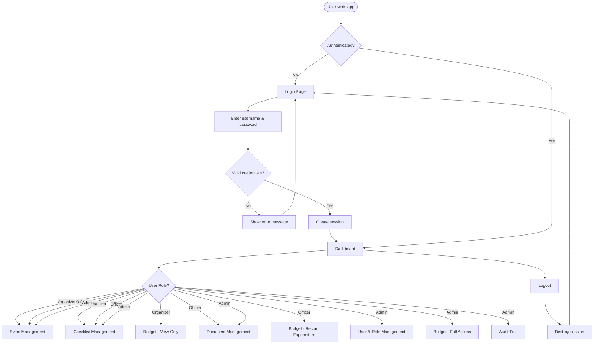
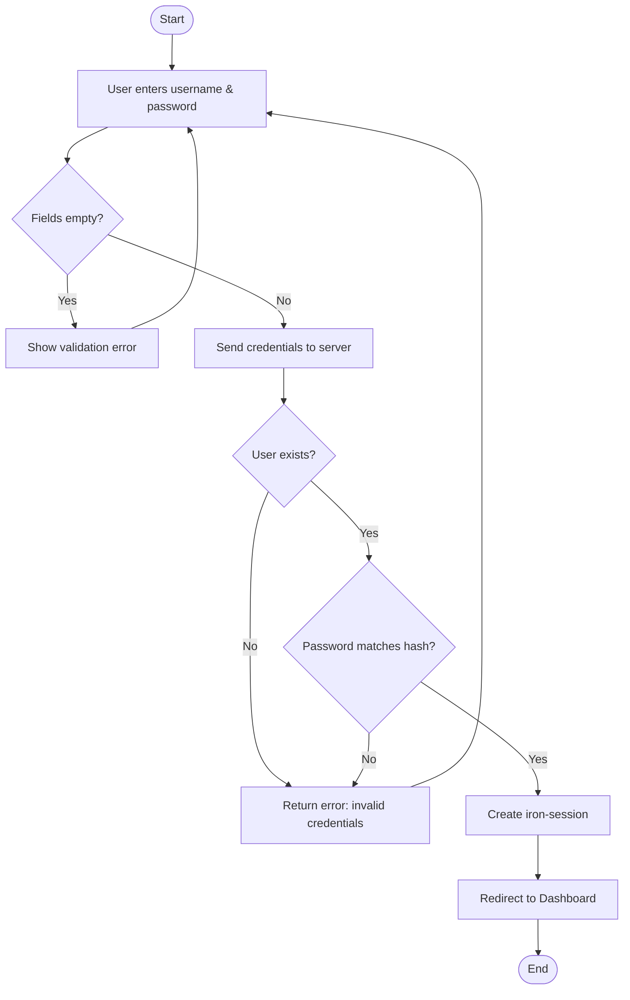
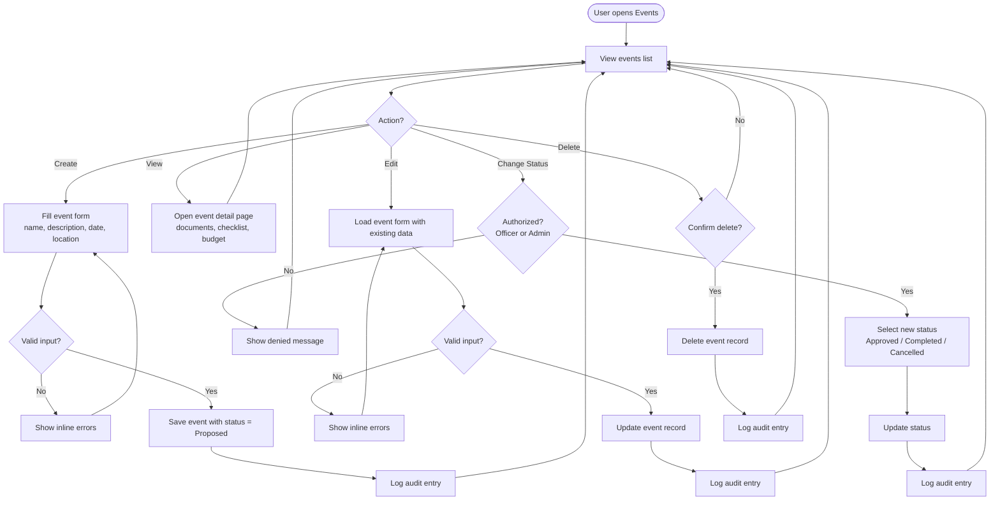
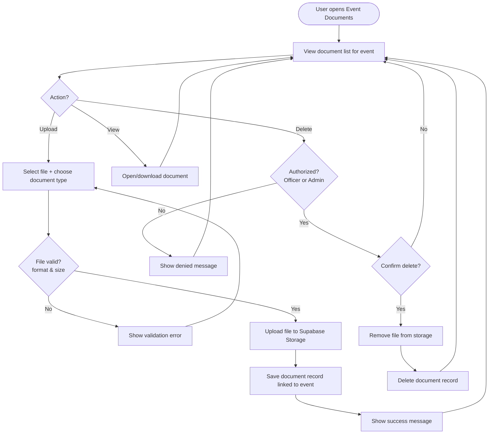
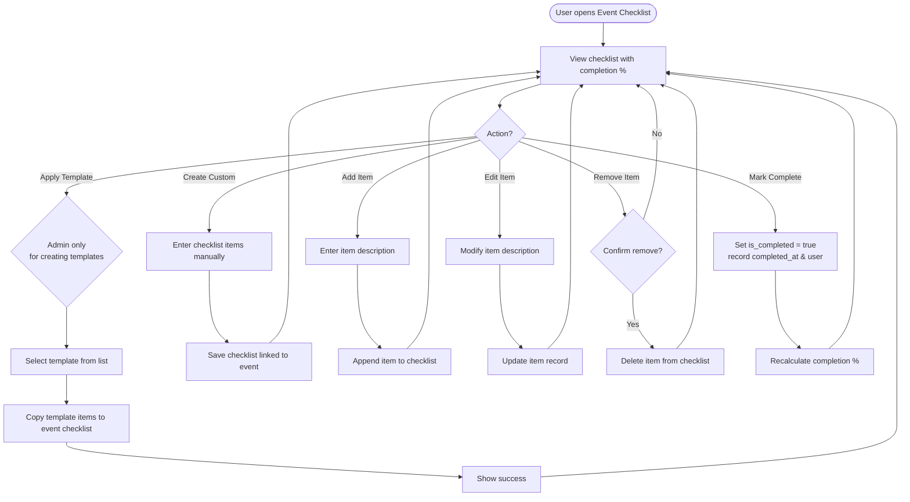
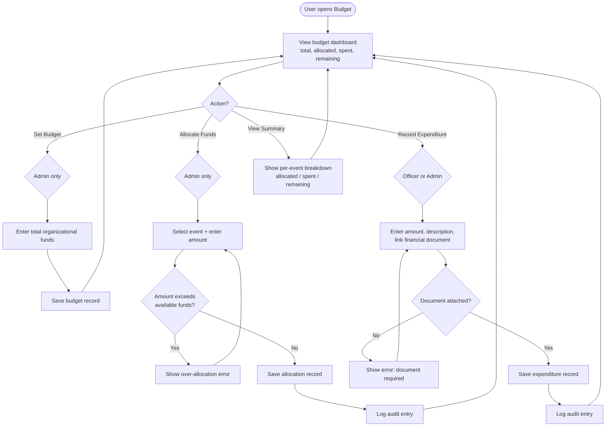
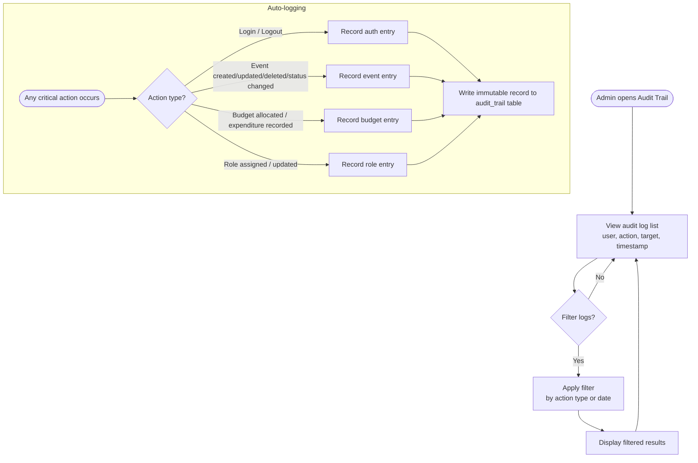
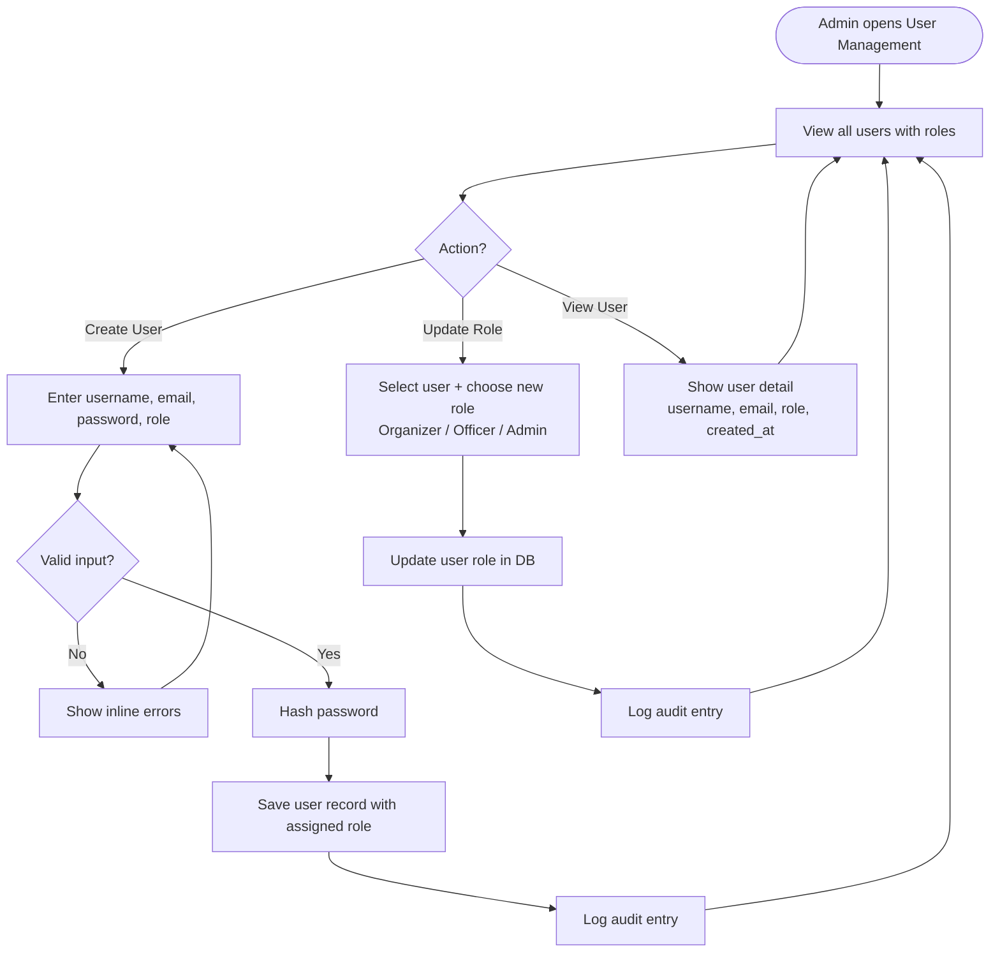

# Structura — Flowcharts

All flowcharts are written in Mermaid. Use a Mermaid-compatible viewer (e.g. VS Code Mermaid Preview, mermaid.live) to render them.

---

## 1. App Navigation Flow (Dashboard → Login → Modules)

---

## 2. Authentication Flow

---

## 3. Event Management Flow

---

## 4. Document Management Flow

---

## 5. Checklist Management Flow

---

## 6. Budget Management Flow

---

## 7. Audit Trail Flow

---

## 8. User & Role Management Flow

---

Document Version: 1.0
Last Updated: March 2026
