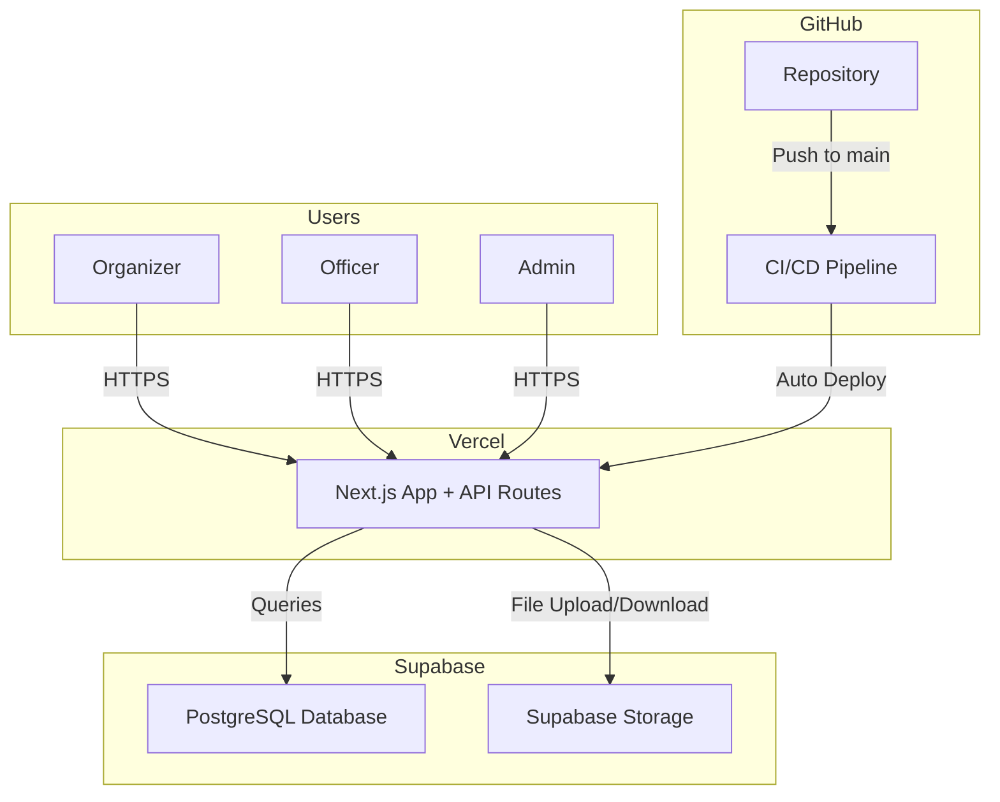
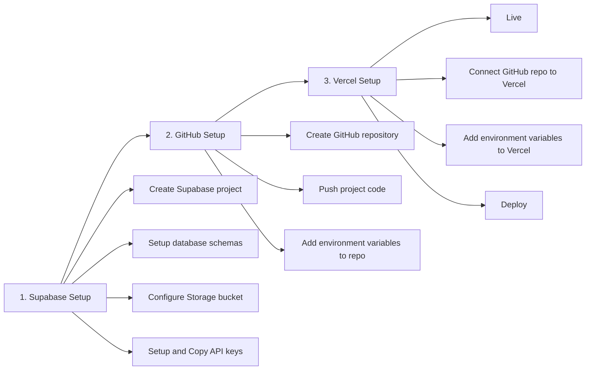

# Structura - Network / Infrastructure Diagram

## Overview

This document describes the infrastructure setup and deployment process for the Structura platform.

## Network Diagram

## Deployment Setup Process

## Components

- Users — Organizers, Officers, and Admins access the platform via browser over HTTPS
- GitHub — Source code repository; CI/CD pipeline auto-deploys to Vercel on every push to main
- Vercel — Hosts the Next.js application and API routes
- Supabase PostgreSQL — Stores all application data (users, events, documents, checklists, budgets)
- Supabase Storage — Stores uploaded files (permits, contracts, receipts, financial documents)

## Environment Variables Required

| Variable | Description |
|----------|-------------|
| SUPABASE_URL | Supabase project URL |
| SUPABASE_ANON_KEY | Supabase public API key |
| SUPABASE_SERVICE_ROLE_KEY | Supabase service role key (server-side only) |
| SESSION_SECRET | Secret key for iron-session cookie encryption |
