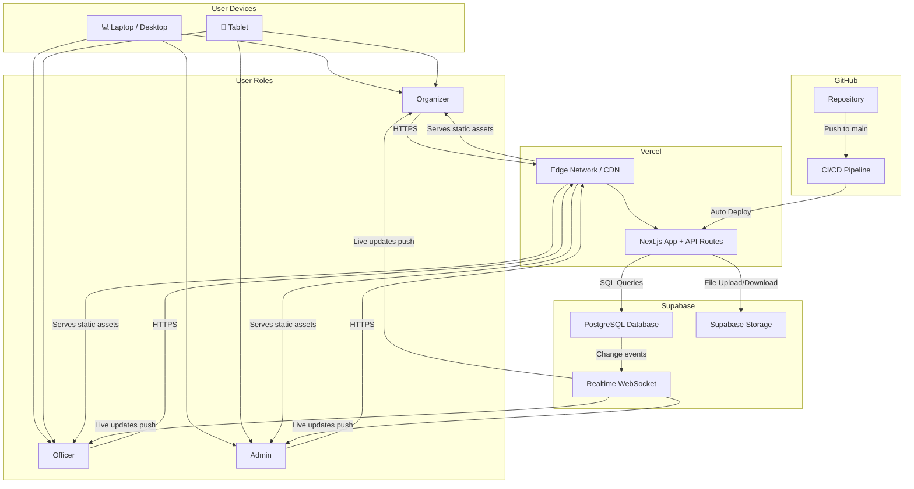
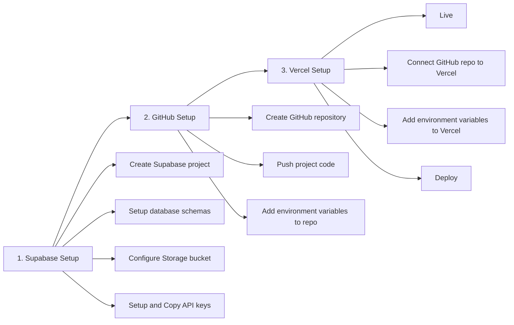

# Structura - Network / Infrastructure Diagram

## Overview

This document describes the infrastructure setup and deployment process for the Structura platform.

## Network Diagram

```mermaid
graph TB
    subgraph Devices["User Devices"]
        LA[💻 Laptop / Desktop]
        TB[📱 Tablet]
    end

    subgraph Users["User Roles"]
        A[Organizer]
        B[Officer]
        C[Admin]
    end

    subgraph GitHub["GitHub"]
        D[Repository]
        E[CI/CD Pipeline]
    end

    subgraph Vercel["Vercel"]
        VE[Edge Network / CDN]
        F[Next.js App + API Routes]
    end

    subgraph Supabase["Supabase"]
        I[PostgreSQL Database]
        J[Supabase Storage]
        K[Realtime WebSocket]
    end

    LA & TB --> A & B & C
    A & B & C -->|HTTPS| VE
    VE -->|Serves static assets| A & B & C
    VE --> F
    D -->|Push to main| E
    E -->|Auto Deploy| F
    F -->|SQL Queries| I
    F -->|File Upload/Download| J
    K -->|Live updates push| A & B & C
    I -->|Change events| K
```

## Deployment Setup Process

```mermaid
flowchart LR
    A[1. Supabase Setup] --> B[2. GitHub Setup] --> C[3. Vercel Setup] --> D[Live]

    A --> A1[Create Supabase project]
    A --> A2[Setup database schemas]
    A --> A3[Configure Storage bucket]
    A --> A4[Setup and Copy API keys]

    B --> B1[Create GitHub repository]
    B --> B2[Push project code]
    B --> B3[Add environment variables to repo]

    C --> C1[Connect GitHub repo to Vercel]
    C --> C2[Add environment variables to Vercel]
    C --> C3[Deploy]
```

## Components

- Devices — Users access the platform via laptop/desktop or tablet browsers over HTTPS
- User Roles — Organizers, Officers, and Admins each have role-scoped access to the platform
- GitHub — Source code repository; CI/CD pipeline auto-deploys to Vercel on every push to main
- Vercel Edge Network — CDN layer that serves static assets globally and routes requests to the Next.js app
- Vercel (Next.js) — Hosts the Next.js application and API routes (serverless functions)
- Supabase PostgreSQL — Stores all application data (users, events, documents, checklists, budgets)
- Supabase Storage — Stores uploaded files (permits, contracts, receipts, financial documents)
- Supabase Realtime — Pushes live database change events to connected clients via WebSocket

## Environment Variables Required

| Variable | Description |
|----------|-------------|
| SUPABASE_URL | Supabase project URL |
| SUPABASE_ANON_KEY | Supabase public API key |
| SUPABASE_SERVICE_ROLE_KEY | Supabase service role key (server-side only) |
| SESSION_SECRET | Secret key for iron-session cookie encryption |
